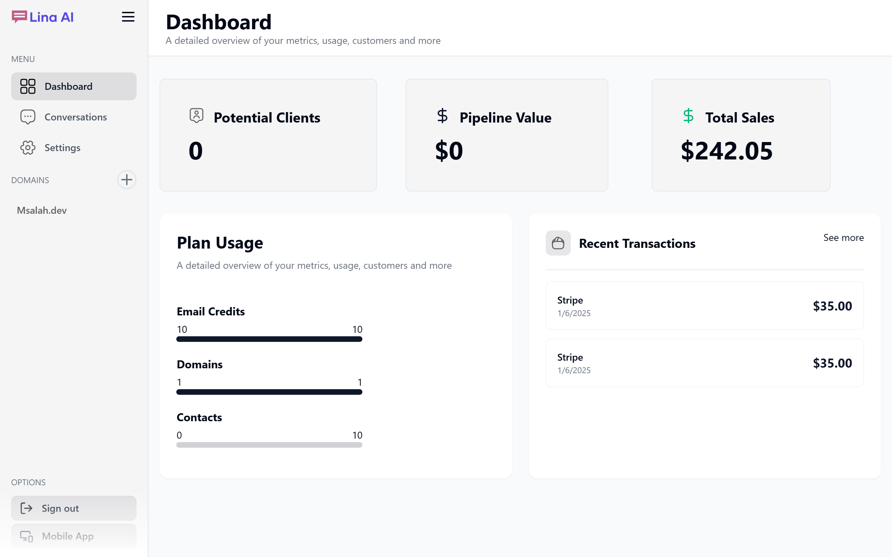
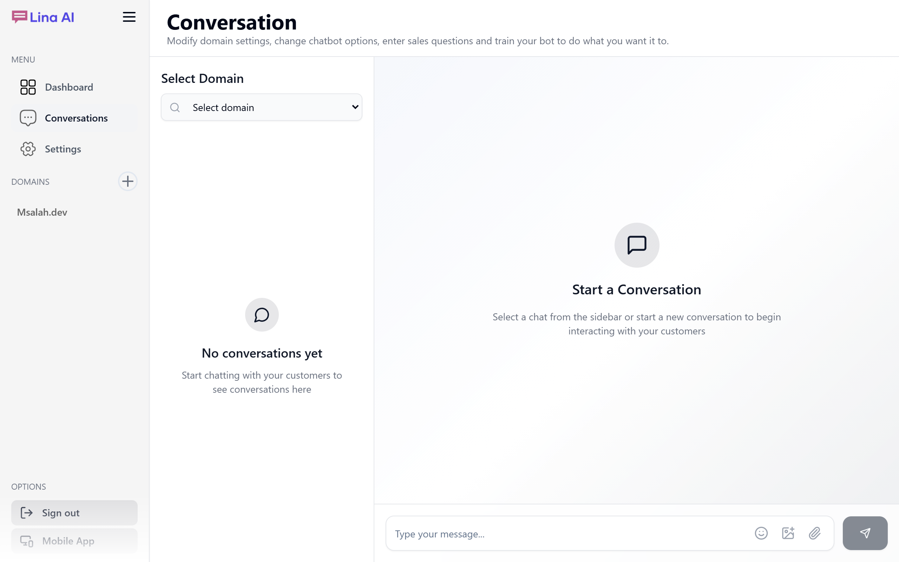
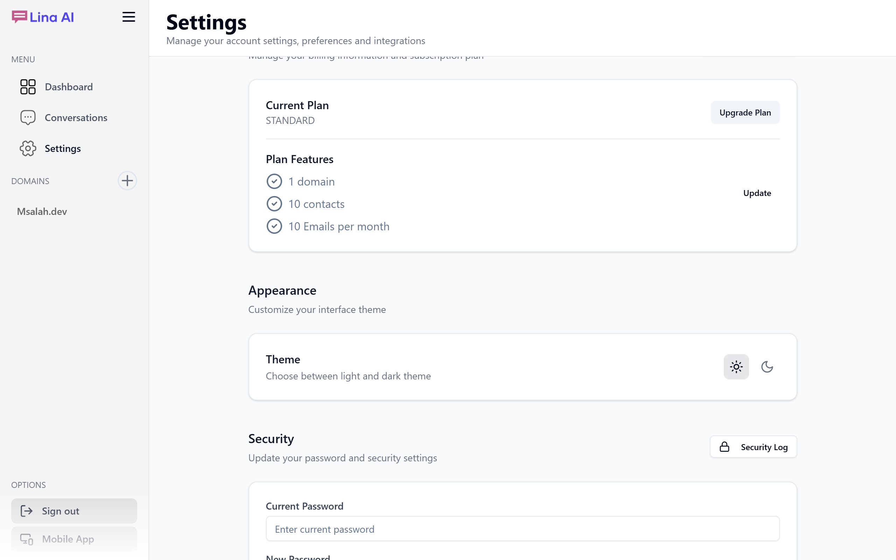
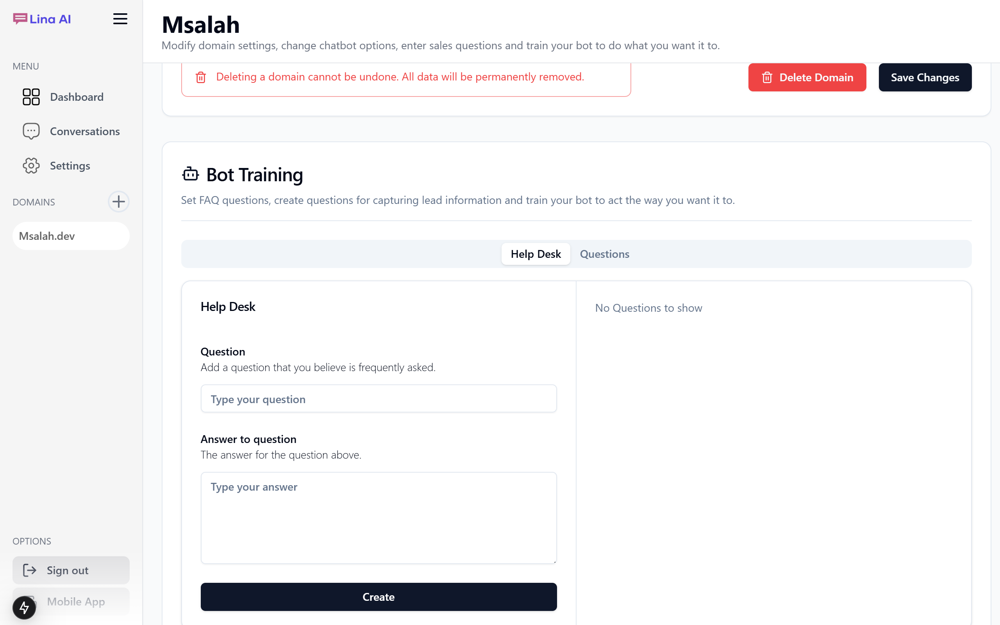

# Lina AI - Intelligent Conversational AI Platform

<div align="center">
  <h3>🤖 Powerful Multi-Domain AI Chatbot Solution</h3>
</div>

Lina AI is a sophisticated AI-powered chatbot platform that enables businesses to deploy intelligent conversational agents across multiple domains. Built with modern technologies and designed for scalability, Lina AI offers a powerful solution for businesses looking to enhance their customer engagement through AI.

## 📸 Screenshots

<div align="center">
  
  <p><em>Landing Page - Modern and engaging user interface</em></p>
  
  
  <p><em>Dashboard - Powerful admin controls and analytics</em></p>
  
  
  <p><em>Chat Interface - Intuitive and responsive chat experience</em></p>
  
  
  <p><em>Settings Panel - Easy configuration and customization</em></p>
</div>

## ✨ Features

- 🌐 **Multi-Domain Support**: Deploy and manage chatbots across multiple domains from a single dashboard
- 🎨 **Customizable Interface**: Modern and responsive UI with customizable themes
- 🔒 **Enterprise-Grade Security**: Robust security measures with role-based access control
- 🔄 **Real-Time Communication**: Powered by Pusher for seamless real-time interactions
- 🎯 **Smart Responses**: Leveraging OpenAI for intelligent and context-aware conversations
- 📊 **Analytics Dashboard**: Comprehensive insights into chatbot performance
- 💳 **Subscription Management**: Integrated with Stripe for seamless billing

## 🚀 Tech Stack

- **FullStack**: Next.js 14, TypeScript, Tailwind CSS
- **Database**: PostgreSQL
- **Authentication**: Clerk
- **Real-time**: Pusher
- **AI**: OpenAI
- **File Storage**: Upload Care
- **Payment**: Stripe
- **Email**: NodeMailer

## 🛠 Getting Started

1. **Clone the repository**
   ```bash
   git clone git@github.com:Msalah11/Lina-AI.git
   cd Lina-AI
   ```

2. **Install dependencies**
   ```bash
   npm install
   # or
   yarn install
   ```

3. **Set up environment variables**
   ```bash
   cp .env.example .env
   ```
   Fill in all required environment variables in the `.env` file

4. **Set up the database**
   ```bash
   npx prisma generate
   npx prisma db push
   ```

5. **Run the development server**
   ```bash
   npm run dev
   # or
   yarn dev
   ```

Open [http://localhost:3000](http://localhost:3000) to view the application.

## 🌟 Key Features Explained

- **Multi-Domain Management**: Easily configure and manage chatbots for different domains
- **Real-Time Chat**: Instant message delivery and updates using Pusher
- **File Handling**: Secure file uploads and management with Upload Care
- **Payment Processing**: Subscription management with Stripe integration
- **User Authentication**: Secure authentication flow using Clerk
- **Email Notifications**: Automated email notifications using NodeMailer

## 📝 Environment Variables

Refer to `.env.example` for all required environment variables. Make sure to set up:
- Database connection
- OpenAI API key
- Clerk authentication keys
- Pusher credentials
- Stripe API keys
- Upload Care configuration
- Email service credentials

## 🤝 Contributing

Contributions are welcome! Feel free to submit issues and pull requests.

## 📄 License

This project is licensed under the MIT License - see the LICENSE file for details.

## 📧 Contact

For any queries or support, please reach out through:
- GitHub Issues
- [GitHub Repository](https://github.com/Msalah11/Lina-AI)
